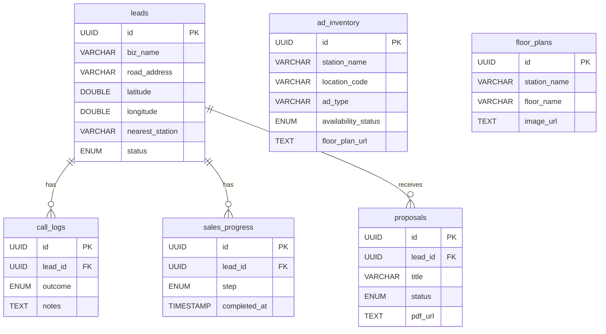

# 데이터베이스 문서 (Database Documentation)

서울 지하철 광고 영업 관리 시스템의 데이터베이스 스키마 및 구조에 대한 문서입니다.

## 1. 개요 (Overview)

- **Database Engine**: PostgreSQL (via Supabase)
- **주요 기능**: 리드 관리, 인벤토리, 제안서, 영업 활동 기록
- **보안**: RLS (Row Level Security) 적용

## 2. ER 다이어그램 (Entity-Relationship Diagram)

## 3. 테이블 상세 (Tables)

### 3.1 `leads` (리드/사업장 정보)
핵심 테이블로, 잠재 고객(병원, 의원 등)의 정보를 저장합니다.

| 컬럼명 | 타입 | 설명 | 비고 |
|--- |--- |--- |--- |
| `id` | UUID | Primary Key | |
| `biz_name` | VARCHAR | 상호명 | |
| `road_address` | TEXT | 도로명 주소 | |
| `category` | VARCHAR | 업종 카테고리 | 기본값: 'HEALTH' |
| `nearest_station` | VARCHAR | 가장 가까운 역 | 역세권 분석용 |
| `status` | ENUM | 리드 상태 | `NEW`, `PROPOSAL_SENT`, `CONTACTED`, `CONTRACTED` |

### 3.2 `ad_inventory` (광고 인벤토리)
지하철 역사의 광고 매체 정보입니다.

| 컬럼명 | 타입 | 설명 | 비고 |
|--- |--- |--- |--- |
| `id` | UUID | Primary Key | |
| `station_name` | VARCHAR | 역사명 | |
| `location_code` | VARCHAR | 위치 코드 | 고유 식별자 |
| `ad_type` | VARCHAR | 광고 유형 | 조명/비조명 등 |
| `floor_plan_url` | TEXT | 도면 이미지 URL | |
| `availability_status` | ENUM | 가용 상태 | `AVAILABLE`, `RESERVED`, `OCCUPIED` |

### 3.3 `floor_plans` (역사 도면)
역사별 층별 안내도 이미지 정보입니다.

| 컬럼명 | 타입 | 설명 | 비고 |
|--- |--- |--- |--- |
| `id` | UUID | Primary Key | |
| `station_name` | VARCHAR | 역사명 | Unique |
| `image_url` | TEXT | 도면 이미지 주소 | |
| `thumbnail_url` | TEXT | 썸네일 주소 | |

### 3.4 `proposals` (제안서)
생성된 제안서의 메타데이터와 PDF 링크를 저장합니다.

| 컬럼명 | 타입 | 설명 | 비고 |
|--- |--- |--- |--- |
| `id` | UUID | Primary Key | |
| `lead_id` | UUID | 리드 ID (FK) | |
| `status` | ENUM | 제안 상태 | `DRAFT`, `SENT` 등 |
| `pdf_url` | TEXT | 생성된 PDF URL | |

### 3.5 `call_logs` (통화 기록)
영업 사원의 통화 및 방문 활동 이력입니다.

| 컬럼명 | 타입 | 설명 | 비고 |
|--- |--- |--- |--- |
| `lead_id` | UUID | 리드 ID (FK) | |
| `outcome` | ENUM | 결과 | `INTERESTED` 등 |
| `next_action` | TEXT | 다음 활동 계획 | |

## 4. 공통 데이터 타입 (ENUMs)

- **`lead_status`**: 신규(`NEW`), 제안발송(`PROPOSAL_SENT`), 컨택완료(`CONTACTED`), 계약성사(`CONTRACTED`)
- **`availability_status`**: 판매가능(`AVAILABLE`), 예약중(`RESERVED`), 판매완료(`OCCUPIED`)
- **`proposal_status`**: 초안(`DRAFT`), 발송됨(`SENT`), 열람함(`VIEWED`), 수락(`ACCEPTED`), 거절(`REJECTED`)
